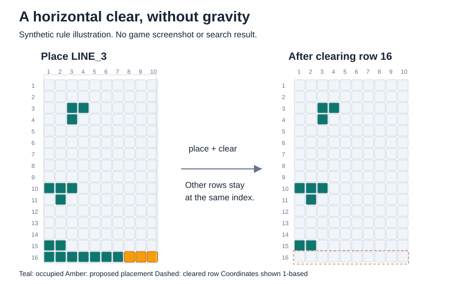
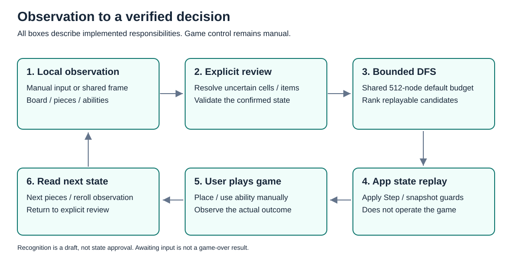
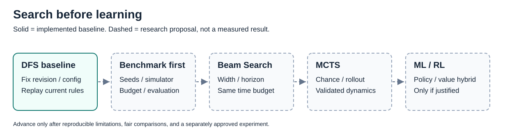

# Hangeul Decision Lab

### Budgeted Search and a Research Agenda for a Hangul Block Puzzle

**Implemented:** deterministic DFS assistant, seeded synthetic simulator and DFS benchmark · **CPU CNN imitation:** IN PROGRESS · **RL:** FUTURE

## Abstract

Hangeul Decision Lab은 메이플스토리 한글날 이벤트의 16행 × 10열 블록 퍼즐을 상태 공간 문제로 모델링하고, 제한된 계산 예산 안에서 현재 조각과 특수 능력의 사용 순서를 추천하는 웹 도구다. 현재 구현은 합법 배치 열거, 공통 게임 전이, 사전식 상태 평가, 완료된 부분 탐색의 재사용을 결합한 deterministic depth-first search(DFS)를 사용한다. 화면 입력은 로컬 캡처·판별·사용자 검토를 거쳐 명시적으로 확정하며 실제 게임 조작은 사용자가 수행한다.

장기 연구 질문은 **같은 의사결정 시간 안에서 탐색과 학습이 장기 생존 및 줄 삭제를 얼마나 개선할 수 있는가**이다. 현재 seeded simulator와 재현 가능한 합성 DFS 비교 도구, CPU CNN 모방용 데이터 경계를 구현했다. 이후 탐색 개선·학습 정책과 가치 모델을 비교하고 강화학습을 검토한다. **CNN 학습 결과는 아직 검증 중이며 강화학습은 구현하지 않았다.** 아래 pilot은 실행 기반 확인용이며 알고리즘 우월성이나 전체 게임 최적성을 주장하지 않는다.

**Keywords:** combinatorial planning, bounded DFS, legal-action masking, stochastic planning, reinforcement learning

## 1. Motivation and Research Questions

줄 삭제를 많이 만드는 선택이 다음 조각을 놓기 좋은 상태를 보장하지는 않는다. 조각 순서·회전·반전·아이템·능력과 미래 입력의 불확실성을 함께 고려해야 한다.

현재 구현의 기여는 UI와 분리된 전이/솔버, 예산과 후보 제한을 드러내는 탐색, 추천의 단계별 재생, 인식 결과의 명시 검토 및 공유 세션의 턴 연결이다. 아래 질문들은 **향후 비교 연구**다.

- **RQ1 — Budget:** 예산 확대로 놓친 유효 경로를 찾을 수 있는가?
- **RQ2 — Evaluation:** 후보 순서·가지 제거·평가 편향 중 무엇이 선택을 제한하는가?
- **RQ3 — Uncertainty:** 미래 조각/재뽑기 샘플링이 같은 시간의 결정적 탐색보다 유리한가?
- **RQ4 — Learning:** 앞선 개선 후에도 남는 한계를 학습한 policy/value가 추가 비용을 감수할 만큼 해결하는가?

## 2. Problem Formulation

$$s=(B,P,I,A,r)$$

| 기호 | 현재 의사결정 상태                          |
| ---- | ------------------------------------------- |
| $B$  | 16 × 10 Boolean 점유 보드                   |
| $P$  | 남은 최대 3조각의 instance·화면 slot·형상   |
| $I$  | 미획득 아이템의 좌표/종류, 보드 위 최대 3개 |
| $A$  | 점 찍기/바꿔 뽑기 횟수, 보유 합계 최대 7개  |
| $r$  | 재뽑기 결과를 기다리는 대상 또는 null       |

action은 조각 배치, 빈칸 한 곳에 점 찍기, 남은 조각 재뽑기다. 조각 사용 순서는 자유롭고 slot은 화면 위치 식별자다. 회전/반전의 중복 variant를 제거하고 실제 true 셀만 경계/충돌 검사한다. 가로줄은 동시에 삭제되며 중력은 없다. 능력을 소모한 뒤 삭제 행의 아이템을 행·열 순으로 획득하고, 상한 때문에 미획득한 아이콘은 같은 좌표에 남긴다.

19종 형상/한글 이름은 제공된 자료를 기반으로 한다. ㄹ/ㅌ은 각각 8칸, 점·ㅡ·ㅣ는 각각 1·3·5칸이다. 전체 형상/규칙의 독립 실전 대조, 새 아이콘 생성, 단계별 출현 확률은 미완료다. 이벤트 배경은 [공식 안내][1]를 참고한다.



_Figure 1. 합성 규칙 예제. 마지막 행의 빈 3칸에 ㅡ를 배치하면 그 행만 비워지고 위의 셀은 제자리에 남는다. 게임 캡처·솔버 추천·성능 실험 결과가 아니다._

## 3. Implemented Method

### 3.1 Bounded DFS

기본값은 `maxNodes=512`, `maxAlternatives=3`(최선 포함), `useMemoization=true`다. 일반 probe는 전체 예산의 최대 1/4을 사용하고 실제 방문량을 능력 DFS 예산에서 차감한다. 루트를 포함한 합산 방문 수를 제한한다. 일반 조각 소진 깊이는 최대 남은 3개지만 능력 사용/재획득을 포함한 action 깊이는 고정 3이 아니다.

```text
probe := ordinary-only DFS using part of the node budget
seed candidates with suitable terminal paths from the probe
DFS(state):
    stop and evaluate when awaiting next pieces or reroll input
    reuse only completed subtrees with the same search key
    enumerate configured ordinary and ability candidates
    apply actions through the shared domain transition
    stop at the node limit and mark the search incomplete
    rank evaluated candidates; retain up to three results
```

search key는 점유·남은 instance/형상·아이템·능력·pending·누적 삭제/획득을 포함한다. 예산 때문에 중단된 subtree는 memo하지 않는다. 동등 경로를 재사용하므로 대안과 경로 count가 모든 고유 경로의 열거는 아니다.

### 3.2 Evaluation and Ability Candidates

현재 gameover 회피 → 현재 조각 소진 → catalog 배치 가능 종류/배치 수 → 삭제 행 → 아이템 획득 → 능력 잔여 → 적은 고립/coverage gap → 많은 빈칸 순으로 **사전식 비교**한다. 학습한 weighted reward가 아니다.

점 찍기는 모든 합법 빈칸을 후보로 두고 즉시 행 삭제부터 탐색한다. 재뽑기는 막힌 조각, 초기 probe에서 소진 경로 미발견, 또는 catalog 배치 가능 종류 0인 경우에 제한적으로 추가한다. 미완료 probe의 미발견은 불가능 증명이 아니다. 전체 domain 합법 mask와 solver의 제한된 후보를 구별한다.

mobility는 catalog 배치 종류/개수이며 미래 생존 또는 출현 확률이 아니다. coverage gap도 셀 덮임 지표다. 점 조각이 있으면 gap이 0이어도 큰 조각 소진을 보장하지 않는다. 재뽑기 결과는 실제 다른 조각을 관측해 입력받고 현재 탐색은 pending에서 멈춘다.



_Figure 2. 구현된 입력–검토–탐색–재생 경계. 판별기는 초안을 만들고 사용자가 확인한 뒤 GameState에 반영한다. Apply Step은 앱 상태 재생이며 실제 게임 배치는 사용자 조작이다._

### 3.3 Observation and Review

선택한 화면 공유의 한 프레임에서 보드 점유·보유 조각 도형·능력 숫자를 로컬 판별한다. 미확정 칸은 캡처 위에서 바로 수정하고 아이템 위치/종류는 점유와 별도로 검토한다. 초안을 자동 승인하지 않는다. 같은 공유에서는 영역/직전 확인 상태를 이어 쓰고 마지막 정상 Apply 뒤 제한된 자동 재읽기로 새 조각을 기다린다. 차이와 새 아이콘은 명시 확인한다.

캡처/임시 픽셀은 제한된 탭 메모리 수명 뒤 폐기한다. 저장·업로드·계정 연동·게임 자동 조작 기능은 없다.

## 4. Validation Scope and Limitations

검사는 합성 보드, 독립 좌표 oracle, 전이 replay, 예산/memo, 입력 수명 및 브라우저 여정을 다룬다. 작은 fixture의 완전 비교는 해당 범위의 correctness 근거이고 전체 게임 oracle가 아니다. `optimalWithinScope`는 설정 후보/평가 범위에 한정된다.

실제 연속 턴·전체 형상/숫자/배율의 인식 정확도·신규 아이콘/확률·사람 사용감/별도 제품 수락은 미완료다. 짧은 합성 episode의 관측은 다음 절에 제시한다. 실제 게임 장기 생존·알고리즘 승률·학습 curve의 증거로 확대하지 않는다.

## 5. Synthetic Benchmark and Future Research

### 5.1 Benchmark First

실제 게임 플레이 없이 기존 domain 전이를 재사용하는 headless simulator를 실행할 수 있다. 합성 환경은 19종 조각에 동등 가중치를 주고 재뽑기에서 현재 종류를 제외하며, 초기 아이템만 사용한다. 실제 출현 확률·새 아이콘 생성·7수 카운터는 모델링하지 않는다. 실제 게임 일치 검증은 별도 과제로 유지한다. 학습 pipeline은 아직 없다.

초기 상태, catalog/rules version, 다음 조각/재뽑기/아이콘 과정, seed/PRNG, 종료/horizon을 고정한다. 환경/정책/rollout/학습 난수를 분리하고 action별 난수 소비 차이를 통제한다. 미래 tape를 정책에 노출하지 않는다. 다음 입력 대기·실제 gameover·시간/episode truncation을 구별하고 임의 균등분포를 실제 출현 확률로 가정하지 않는다.

| Metric                      | 비교 정의                                                    |
| --------------------------- | ------------------------------------------------------------ |
| Survival / terminal step    | 소진 세트와 일반/능력 action 수, gameover/truncation 분리    |
| Clears / acquired items     | 누적 삭제 행/실제 획득, 잔류 아이템 제외                     |
| Ability usage               | 종류별 소모·재획득·잔여/구제 결과                            |
| Decision latency            | 합법 후보/평가/탐색/추론의 mean/p95, load/warmup 분리        |
| Search cost / memory        | 알고리즘별 nodes/simulations/memo, 정의한 heap/RSS/피크 한계 |
| Reference / reproducibility | 유효 경로 도달률, action/state hash, 오류/timeout/분산       |

같은 초기 상태·paired seeds·종료/시간 상한으로 비교한다. 알고리즘 간 node count를 동일 비용으로 취급하지 않는다. train/dev/test는 seed와 fixture 계열을 분리하고 test benchmark로 학습/tuning하지 않는다. reward 합계 외에 생존/삭제·지연/메모리·안정성을 보고한다.

**실행된 pilot — 2026-10-07.** seed 17·42·2026 × sparse/pressure 보드의 6개 dev fixture를 예산 128/512, memo 사용, 대안 3개, 최대 12행동으로 각각 2번 실행했다. 총 24episode이며 반복을 독립 표본으로 세지 않는다. 실행 순서는 회전하고 별도 seed 0의 warmup은 제외했다. 모든 episode 재생과 반복 trace 일치가 통과했다.

| 관측                           |   DFS 128 |    DFS 512 |
| ------------------------------ | --------: | ---------: |
| 평균 수행 행동 / 최대 12       |      7.67 |       8.00 |
| 평균 삭제 행                   |      0.83 |       1.00 |
| 평균 판단 시간                 |  395.79ms | 1,400.62ms |
| 판단 시간 p95                  |  596.17ms | 2,254.72ms |
| 불완전 탐색 / 판단 횟수        |   86 / 94 |    72 / 96 |
| gameover / horizon / 정책 포기 | 4 / 6 / 2 |  6 / 6 / 0 |

측정 환경은 Windows 10, i5-9400F, Node 24.15.0, 단일 worker다. 판단 시간은 `solveTurn` 호출부터 반환까지이며 simulator 합법 action 생성·환경 공급·replay·모듈 로드는 제외한다. p95는 유효 episode의 판단 표본에서 nearest-rank로 계산한다. 보드마다 행동 경로가 달라 두 설정의 판단 표본 수는 다르다. 이 비교는 **동일 시간 예산 실험이 아니다**. 전후 Node heap은 약 43.87→108.68MiB, RSS는 226.77→358.22MiB였으며 compiler·누적 기록을 포함한 전체 프로세스 관측이다. 순간 피크나 브라우저 메모리 기준이 아니다.

6개 paired fixture 중 pressure-42에서만 DFS 512가 2행동 더 진행하고 1행 더 지웠다. 그 외 합산 행동/삭제는 같았다. sparse 3개는 모두 길이 제한에 도달했고 아이템 획득은 전부 0이었다. 따라서 장기 생존·아이템 전략·학습 효과를 판정할 표본은 부족하다. 정책 포기는 합법 action이 남아도 정책이 action을 반환하지 않은 경우이며 gameover와 구분한다. 관측·protocol·source/trace hash의 기계 판독 기록은 [pilot summary](assets/research/pilot-budget-20261007-v1.json)에 있다. CLI는 전체 fixture/tape/action/state 기록을 로컬 JSON으로 생성한다.

### 5.2 Search Before Learning



_Figure 3. DFS와 합성 benchmark 기반은 구현되어 있다. 점선 방법은 향후 비교안이며, 반복 가능한 한계와 비용 대비 개선 근거에 따라 선택한다. 도식 자체는 측정 결과가 아니다._

1. **Baseline / budget:** revision/config·probe·memo·평가를 고정하고 예산 곡선을 만든다.
2. **Pruning / evaluation:** 작은 완전 reference로 잘못된 제거를 검출하고 후보 순서·평가를 ablation한다.
3. **Beam Search:** width/depth·중복 제거·미래 sampling·cutoff 평가를 같은 시간의 DFS와 비교한다.
4. **MCTS:** 검증된 확률 모델에서 selection → expansion → rollout → evaluation → backpropagation을 검토한다. rollout 정책/깊이/수·chance 전이·재사용·변동성을 기록한다. UCT[2]는 개념 참고이며 본 게임 효용의 증거가 아니다.
5. **Conditional ML/RL:** 앞선 개선 후 유의미한 잔여 한계가 있고 학습/추론 예산과 별도 승인이 있을 때만 검토한다.

### 5.3 Conditional Policy / Value Learning

점유/아이템 plane과 조각/능력 입력의 CNN encoder·policy/value head를 첫 표현 가설로 검토한다. RNN은 의미 있는 시간 의존성, GNN은 구조 표현의 측정 가능한 이점이 있을 때 비교한다. 채택된 모델은 없다.

DQN[3], Actor-Critic/PPO[4], policy-guided search, learned value + MCTS는 후보 방법이다. 합법성은 기존 domain mask와 최종 전이 검증이 맡는다. 학습은 승인된 simulator episode 생성이며 상대방과 대전하는 무조건적 self-play로 설명하지 않는다.

reward 후보는 생존/삭제/획득과 mobility·능력 잔여·고립/불필요한 소모의 shaping이다. 가중치/terminal penalty는 미정이며 proxy 편향을 ablation한다. 모델은 action ordering/leaf value를 보완하는 hybrid로도 비교한다. 개선이 작거나 지연/메모리/복잡도/불안정성이 크면 deterministic search를 유지한다.

기록은 문제 → 가설 → fixture/seed/config → 관찰 → 해석 → 결정으로 연결하고 실패/기각도 보존한다. chart는 CSV/JSON 원본·생성 방법을 필요로 하며 개념 그림을 측정 결과처럼 사용하지 않는다.

### 5.4 Technology Briefing

| 역할                      | 현재 채택                                        | 다음 제안                                                     |
| ------------------------- | ------------------------------------------------ | ------------------------------------------------------------- |
| 게임 규칙·탐색·시뮬레이션 | TypeScript / Node.js, pure domain, 예산 제한 DFS | 현재 전이를 학습 자료 생성·합법 행동 검증에도 재사용          |
| 화면 입력·검토            | React / Next.js, 브라우저 Canvas의 로컬 판별     | 이번 CNN 실험에서 변경 없음                                   |
| 신경망 학습               | 연구 전용 Python3.13.13 / PyTorch2.14.1+cpu | 소형 CNN 오프라인 학습·held-out 평가 진행 중 |
| 학습 목표                 | 합성 상태에서 DFS512 첫 행동의 supervised imitation | 장기 생존·RL은 별도 후속 연구 |

PyTorch는 모델 구성·학습·CPU 실행을 지원하는 [공식 학습 경로](https://docs.pytorch.org/tutorials/beginner/basics/quickstart_tutorial.html)를 사용할 수 있어 첫 연구 도구로 제안한다. 초기 목표는 학습/추론 경로의 재현 가능성과 비용을 확인하는 것이다. 보드의 점유·아이템 plane과 현재 조각·능력을 입력으로 사용하고, 기존 domain의 전체 합법 행동만 후보로 둔다. 미래 조각/seed를 모델에 알려주지 않으며 DFS의 불완전 탐색 여부도 교사 자료에 기록한다. 교사 선택은 최적 정답이 아니다.

train/dev/test를 seed·episode 단위로 분리해 모방 정확도·불법 행동·CPU 추론 시간·학습 자원을 평가한다. **연구 전용 Python3.13.13/PyTorch2.14.1+cpu를 채택했고 학습·평가는 진행 중이다.** 현재 48개 합성 episode에서 258개 교사 선택과 전체 합법 후보를 생성·재생 검증했다. 기존 앱 추천과 강화학습/실전 생존은 이번 실험 범위 밖이다. 설치 파일만 내려받으며 합성/게임 자료는 외부로 업로드하지 않는다.

## 6. Reproduction and Usage

환경: **Node.js 24.x**, **pnpm 11.16.0**. package/lock에 고정된 TypeScript·Next.js·React·Vitest·Playwright를 사용한다.

```sh
git clone https://github.com/jhpark-jarvis/hangeul-decision-lab.git
cd hangeul-decision-lab
pnpm install --frozen-lockfile
pnpm dev
```

`http://127.0.0.1:45000`에서 수동 입력 후 **Analyze → Apply Step**을 사용한다. 실제 게임 배치는 직접 수행한다. 화면 입력은 **화면 캡처·검토 열기 → Start Screen Capture → 창의 게임 화면 공유 → Capture Frame → 미확정/아이템 수정 → 전체 확인하고 분석**으로 진행한다. 같은 공유에서 조각을 소진하면 자동 다음 턴 읽기 뒤 다시 확인한다. 영역이 어긋나면 **영역 설정**에서 보드/조각/능력을 각각 지정한다. Stop/공유 교체·새로고침은 관련 상태를 초기화한다.

```sh
pnpm test
pnpm lint
pnpm build
pnpm start                  # production: 127.0.0.1:45001
pnpm test:e2e               # 별도 터미널, 설치된 Chrome/Edge 필요
pnpm research:benchmark     # 게임 실행 없이 고정 합성 pilot; 결과는 로컬 .research-output/runs/
node scripts/figures/render.mjs
```

benchmark는 기존 TypeScript compiler로 순수 모듈을 `.research-output/runtime`에 생성하고, 새 결과 폴더에 `protocol.json`, 전체 `report.json`, `summary.csv`를 남긴다. Node/기존 개발 dependency 외에 Python·GPU·새 서비스는 필요하지 않다. 다른 dev 설정은 `pnpm research:benchmark --protocol <json파일> --output <새폴더>`로 지정하며 기존 폴더를 덮어쓰지 않는다. 최대 2,000행동의 실험 행렬과 최대 8,192노드/판단을 허용하며 강제 wall-time timeout은 없다. 저장되는 것은 합성 상태이며 앱의 화면 캡처 저장 기능은 추가하지 않는다.

그림 생성 명령은 SVG 세 개와 합성 입력을 재생성하며 게임 이미지·학습/benchmark를 사용하지 않는다. 입력/metadata는 [figure-data.json](assets/figures/figure-data.json)에 있다. `src/domain`은 규칙/지표/탐색, `src/research`는 simulator/비교, `src/features`는 캡처/인식/검토/세션, `src/components`/`src/app`은 UI, `tests/fixtures`는 비민감 재현 데이터다.

## References

[1]: https://maplestory.nexon.com/News/Event/Ongoing/1393
[2]: https://sites.ualberta.ca/~szepesva/papers/ecml06.pdf
[3]: https://arxiv.org/abs/1312.5602
[4]: https://arxiv.org/abs/1707.06347

1. Nexon. [한글 모아모아 이벤트 안내][1]. 게임 배경 자료이며 독립 형상/확률 검증을 대체하지 않는다.
2. Kocsis, L., & Szepesvári, C. (2006). [Bandit Based Monte-Carlo Planning][2]. ECML, 282–293.
3. Mnih, V., et al. (2013). [Playing Atari with Deep Reinforcement Learning][3]. arXiv:1312.5602.
4. Schulman, J., et al. (2017). [Proximal Policy Optimization Algorithms][4]. arXiv:1707.06347.

논문은 방법 참고이며 본 프로젝트의 성능 증거가 아니다. 모든 그림은 자체 생성 설명용 도식이다. 메이플스토리 상표/게임 저작물의 권리는 각 권리자에게 있으며 공식/제휴 프로젝트가 아니다.
